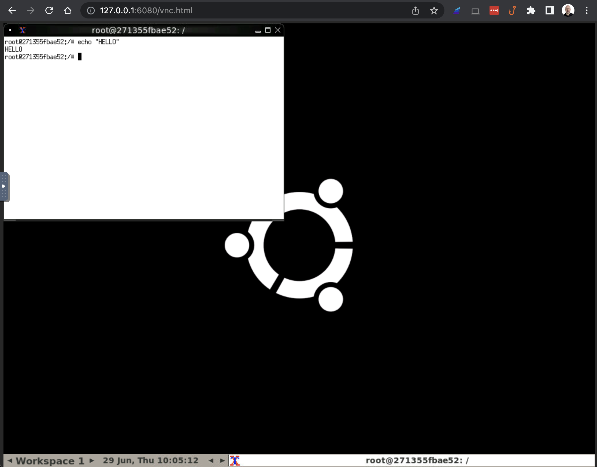

# Ubuntu GUI via Docker

Run a graphical ubuntu instance on docker.



## Installation
```
git clone https://github.com/deriv-experiments/ubuntu-gui-via-docker
cd ubuntu-gui-via-docker
./start.sh
```

## Usage
Visit the URL in your web browser:

http://127.0.0.1:6080/vnc.html
